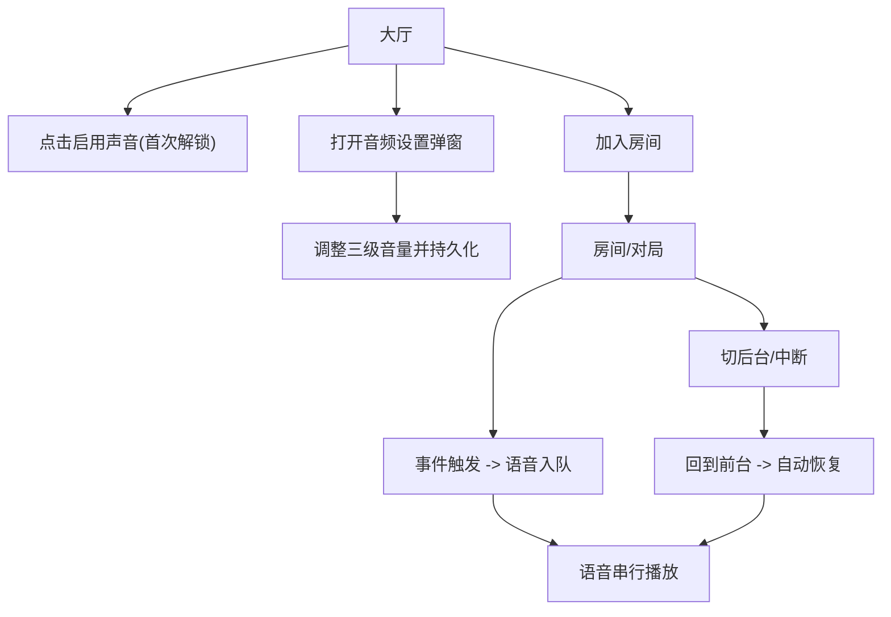

## 1. Product Overview
为你的联机大厅/对局提供一致、可控、可恢复的音频体验：统一播放入口、偏好持久化、分级音量、语音顺序播报、预加载与中断恢复。
面向玩家，目标是在弱网/切后台/重连等场景下，声音仍然“可预期”。

## 2. Core Features

### 2.1 Feature Module
音频系统最小可用版本包含以下页面与核心模块：
1. **大厅**：全局音频初始化（解锁/静音提示）、音频设置入口（弹窗）、UI 音效播放。
2. **房间/对局**：回合关键事件音效/语音播报（队列）、中断恢复与重连后的播报策略。

### 2.3 Page Details
| Page Name | Module Name | Feature description |
|-----------|-------------|---------------------|
| 全局（跨页面） | 全局音频管理器 | 统一管理音频生命周期与播放入口：创建/恢复 AudioContext（或等价能力）；暴露 playBgm/playSfx/enqueueVoice/stop 等方法；对外提供 React Context/Hook 访问；确保多次挂载不重复初始化。 |
| 全局（跨页面） | 用户偏好持久化 | 读取/写入本地偏好（localStorage）：三级音量（0–100）、mute 状态、上次选择的 BGM；应用启动时加载并立即生效；提供“恢复默认”。 |
| 全局（跨页面） | 三级音量（混音） | 提供 3 个可配置通道并实时生效：主音量（Master）× 背景音乐（BGM）× 音效（SFX，包含语音播报）；支持静音开关；任何播放都必须经过混音计算。 |
| 全局（跨页面） | 语音队列 | 语音（播报类音频）按队列顺序串行播放；支持“插队/打断”（高优先级事件）与“去重/节流”（避免同一句重复刷屏）；队列清空与当前语音中止能力。 |
| 全局（跨页面） | 缓存预加载 | 在进入大厅/房间时预加载高频音频（关键 UI 音效、常用播报、默认 BGM）；失败可降级为按需加载；提供加载状态（ready/error）供 UI 展示。 |
| 全局（跨页面） | 中断恢复 | 处理浏览器自动暂停/切后台/音频策略导致的中断：监听 visibilitychange、focus/blur、AudioContext state；恢复后继续 BGM，并对“被打断的语音”按策略继续/重播/丢弃（见对局策略）。 |
| 大厅 | 音频设置入口 | 在顶栏提供“音频”入口；打开设置弹窗：三级音量滑条、静音、测试音效按钮、清空语音队列按钮。 |
| 大厅 | 首次解锁提示 | 若浏览器限制自动播放：提示“点击启用声音”；用户点击后完成解锁并记住偏好；未解锁时允许静默运行（不报错、不弹窗骚扰）。 |
| 大厅 | UI 音效 | 房间列表刷新、加入成功/失败、弹窗开关等触发轻量 SFX；必须支持快速连续点击不爆音（同一音效并发限制/最小间隔）。 |
| 房间/对局 | 事件音效与语音播报 | 对关键事件触发：开局/轮到你/下注确认/超时/AI 接管/重连成功等；语音必须通过“语音队列”；同类事件在短时间内可合并播报。 |
| 房间/对局 | 重连后的播报策略 | 重连恢复时：根据当前回合状态补发“你在几号位/当前轮到谁/剩余时间”等播报（可选语音或提示音），避免把历史队列全部播完。 |

## 3. Core Process
**玩家音频主流程**：打开应用进入大厅 → 首次点击后解锁音频（如需要）→ 在音频设置中调整三级音量并自动保存 → 浏览/加入房间时触发 UI 音效 → 在对局中关键事件进入语音队列顺序播报（必要时高优先级可打断）→ 切后台/来电等导致中断后，回到页面自动恢复 BGM 与后续播报。

**语音队列流程**：对局事件产生语音任务 → 根据优先级/去重规则入队 → 若无正在播放则立即播放 → 播放结束出队播放下一条 → 若高优先级任务到达可选择中止当前语音并切换播放 → 队列清空时立即停止并释放占用。

