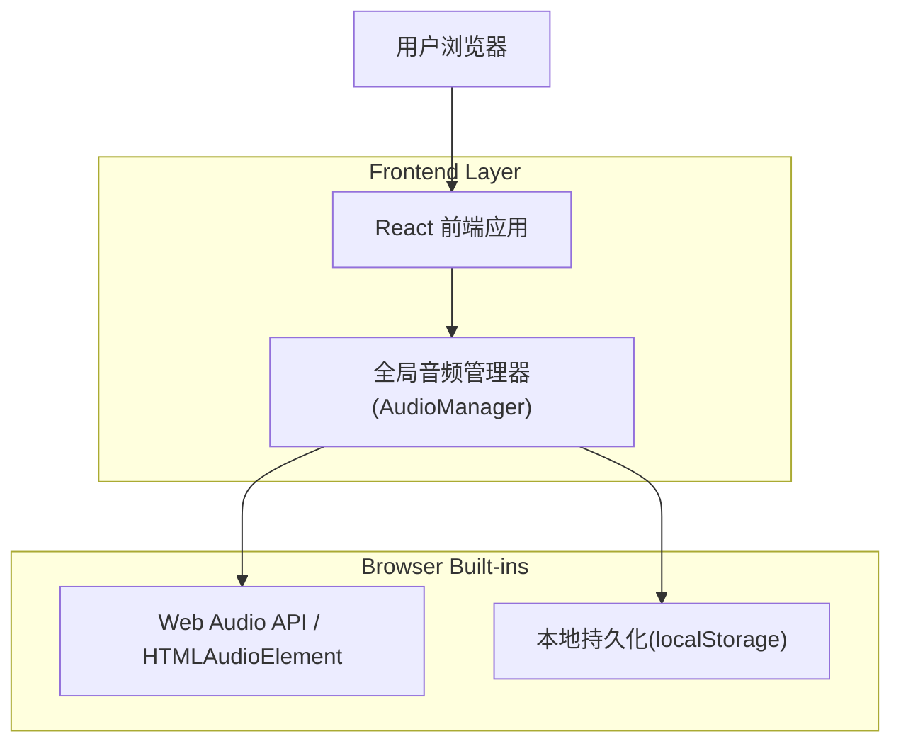

## 1.Architecture design

## 2.Technology Description
- Frontend: React@18 + TypeScript + vite + tailwindcss@3
- Backend: None（音频与偏好均在前端完成）
- Audio (browser): Web Audio API（优先）+ AudioContext 生命周期管理；必要时降级 HTMLAudioElement
- Optional library: howler.js（如你希望降低跨浏览器兼容成本，统一加载/播放/音量管理）

## 3.Route definitions
| Route | Purpose |
|-------|---------|
| / | 大厅：音频解锁提示、设置入口、UI 音效 |
| /room/:roomId | 房间/对局：事件音效与语音队列播报、中断恢复策略 |

## 6.Data model(if applicable)

### 6.1 Data model definition
无后端数据库；仅本地偏好。

### 6.2 Data Definition Language
无。

---

### 本地持久化 Key 约定（实现建议）
- Key: `tuiduizi.audio.prefs.v1`
- Value (JSON):
  - `masterVolume: number`（0.0–1.0）
  - `bgmVolume: number`（0.0–1.0）
  - `sfxVolume: number`（0.0–1.0，包含语音）
  - `muted: boolean`
  - `bgmId?: string`（默认 BGM 资源标识）

### 语音队列数据结构（实现建议）
- `VoiceTask`：
  - `id: string`
  - `src: string`
  - `priority: number`（越大越优先）
  - `interrupt: boolean`（是否允许打断当前语音）
  - `dedupeKey?: string`（同 key 在冷却窗口内丢弃/合并）
  - `cooldownMs?: number`

### 缓存与预加载策略（实现建议）
- `AudioBufferCache`：`Map<string, AudioBuffer | HTMLAudioElement>`
- 预加载时机：
  - App 启动：UI click/notify、默认 BGM
  - 进入房间：回合提示、超时/AI 接管、重连成功等播报
- 失败策略：记录 error 并降级为按需加载；不得阻塞页面主流程。

### 中断恢复策略（实现建议）
- 监听：`visibilitychange`、`pagehide/pageshow`、`focus/blur`、`AudioContext.statechange`
- 恢复触发：用户手势优先（click/keydown/touchstart）；自动恢复失败时在 UI 给出轻提示。
- 恢复内容：
  - BGM：按偏好继续播放并恢复音量
  - 语音：默认不中途“续播”，改为重播当前任务或丢弃（由产品策略决定，推荐“重连后重播摘要语音”）
