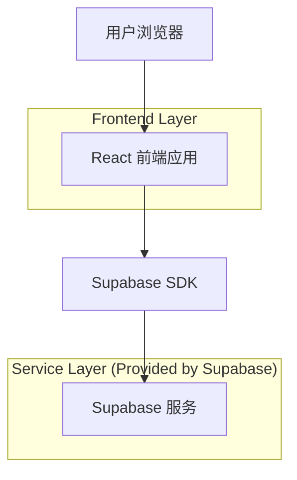
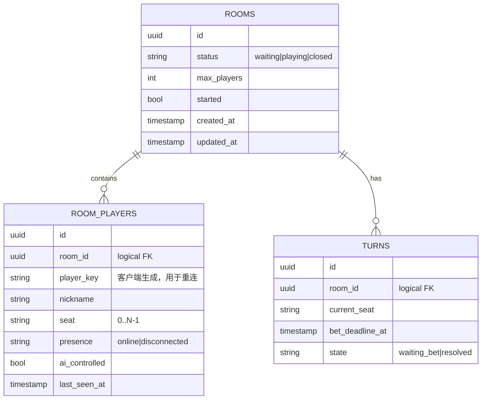

## 1.Architecture design


## 2.Technology Description
- Frontend: React@18 + TypeScript + vite + tailwindcss@3
- Backend: Supabase（PostgreSQL + Realtime）

## 3.Route definitions
| Route | Purpose |
|-------|---------|
| / | 大厅页：展示房间列表、加入房间 |
| /room/:roomId | 房间/对局页：席位状态、倒计时下注、掉线/超时兜底展示 |

## 6.Data model(if applicable)

### 6.1 Data model definition


### 6.2 Data Definition Language
Rooms（rooms）
```
CREATE TABLE rooms (
  id UUID PRIMARY KEY DEFAULT gen_random_uuid(),
  status VARCHAR(20) NOT NULL DEFAULT 'waiting',
  max_players INTEGER NOT NULL DEFAULT 4,
  started BOOLEAN NOT NULL DEFAULT FALSE,
  created_at TIMESTAMPTZ NOT NULL DEFAULT NOW(),
  updated_at TIMESTAMPTZ NOT NULL DEFAULT NOW()
);

CREATE INDEX idx_rooms_status ON rooms(status);
CREATE INDEX idx_rooms_updated_at ON rooms(updated_at DESC);

GRANT SELECT ON rooms TO anon;
GRANT ALL PRIVILEGES ON rooms TO authenticated;
```

Room players（room_players）
```
CREATE TABLE room_players (
  id UUID PRIMARY KEY DEFAULT gen_random_uuid(),
  room_id UUID NOT NULL,
  player_key VARCHAR(64) NOT NULL,
  nickname VARCHAR(32) NOT NULL,
  seat INTEGER NOT NULL,
  presence VARCHAR(20) NOT NULL DEFAULT 'online',
  ai_controlled BOOLEAN NOT NULL DEFAULT FALSE,
  last_seen_at TIMESTAMPTZ NOT NULL DEFAULT NOW(),
  created_at TIMESTAMPTZ NOT NULL DEFAULT NOW(),
  updated_at TIMESTAMPTZ NOT NULL DEFAULT NOW(),
  UNIQUE(room_id, seat),
  UNIQUE(room_id, player_key)
);

CREATE INDEX idx_room_players_room_id ON room_players(room_id);
CREATE INDEX idx_room_players_last_seen_at ON room_players(last_seen_at DESC);

GRANT SELECT ON room_players TO anon;
GRANT ALL PRIVILEGES ON room_players TO authenticated;
```

Turns（turns）
```
CREATE TABLE turns (
  id UUID PRIMARY KEY DEFAULT gen_random_uuid(),
  room_id UUID NOT NULL,
  current_seat INTEGER NOT NULL,
  bet_deadline_at TIMESTAMPTZ NOT NULL,
  state VARCHAR(20) NOT NULL DEFAULT 'waiting_bet',
  created_at TIMESTAMPTZ NOT NULL DEFAULT NOW(),
  updated_at TIMESTAMPTZ NOT NULL DEFAULT NOW()
);

CREATE INDEX idx_turns_room_id ON turns(room_id);
CREATE INDEX idx_turns_deadline ON turns(bet_deadline_at);

GRANT SELECT ON turns TO anon;
GRANT ALL PRIVILEGES ON turns TO authenticated;
```

> 掉线与超时兜底实现建议：
> - 客户端心跳：周期性更新 room_players.last_seen_at。
> - 超时判定：基于 turns.bet_deadline_at 判断，触发“默认动作/AI 接管”并更新 turns.state。
> - 自动补人：当 room_players 数量不足且房间处于 waiting/playing 时，按策略插入 AI 席位（ai_controlled=true）。
