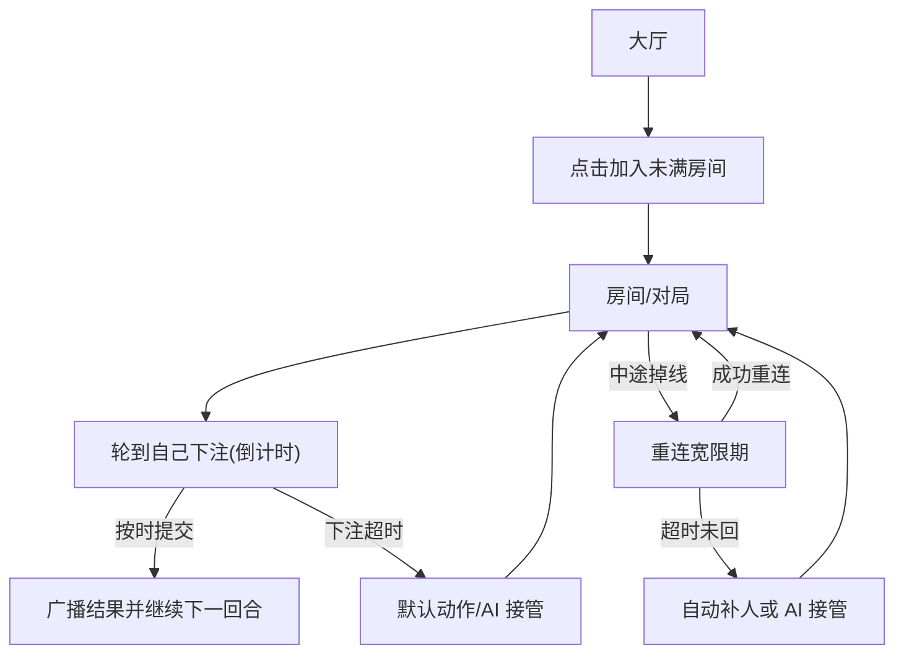

## 1. Product Overview
一个支持多人联机的游戏大厅：展示可加入的房间列表，并处理掉线/下注超时等异常。
核心目标是让玩家快速匹配进房间开局，同时保证对局不中断（自动补人或 AI 接管）。

## 2. Core Features

### 2.1 User Roles
| 角色 | 进入方式 | 核心权限 |
|------|----------|----------|
| 玩家 | 进入大厅后填写昵称（可选：匿名登录） | 浏览房间列表、加入未满房间、在房间内进行下注/操作 |
| 系统/AI | 系统内置 | 监测超时/掉线并接管玩家席位，或触发自动补人 |

### 2.2 Feature Module
我们的多人联机大厅最小可用版本包含以下页面：
1. **大厅**：昵称入口（可选）、房间列表（人数/状态/是否已开局）、加入未满房间。
2. **房间/对局**：房间信息与席位、玩家状态（在线/掉线/AI）、下注倒计时与超时处理、重新连接后的恢复。

### 2.3 Page Details
| Page Name | Module Name | Feature description |
|-----------|-------------|---------------------|
| 大厅 | 昵称/身份入口 | 输入昵称进入大厅；进入后保留到本地并可在本次会话内复用 |
| 大厅 | 房间列表 | 拉取并实时展示房间：房间号/人数(当前/上限)/状态(等待中/进行中)/是否已开局；支持按状态筛选（仅：全部/可加入） |
| 大厅 | 加入房间 | 点击加入“未满”房间；加入成功后进入房间页；加入失败（满员/已关闭）则提示并刷新状态 |
| 房间/对局 | 房间与席位面板 | 展示房间状态、最大人数、玩家席位列表；标记每席位：昵称、在线状态、是否为 AI 接管 |
| 房间/对局 | 下注/行动流程 | 在轮到自己时展示下注输入与倒计时；提交后广播结果；非自己回合展示等待状态 |
| 房间/对局 | 超时与掉线兜底 | 下注超时：自动走默认动作并可触发 AI 接管该席位；中途掉线：在宽限时间内可重连恢复，超过阈值自动补人或 AI 接管；对局不中断 |
| 房间/对局 | 重连恢复 | 玩家重新进入房间时：根据玩家标识恢复到对应席位与当前局面；若已被 AI 接管则提示并按规则处理（继续观战/尝试夺回，取决于规则配置） |

## 3. Core Process
**玩家主流程**：进入大厅 → 查看房间列表（实时更新人数与状态）→ 点击加入未满房间 → 进入房间/对局 → 轮到自己时下注并在倒计时内提交 → 若掉线则在宽限时间内重连恢复；若下注超时或掉线过久，系统自动补人或 AI 接管，保证对局继续。

**系统/AI 兜底流程**：持续监测房间内玩家连接与回合倒计时 → 若玩家下注超时则执行默认动作并可将席位切换为 AI → 若玩家掉线超过阈值则触发“自动补人或 AI 接管”策略 → 将房间与席位状态实时广播给所有在线玩家。

